# <span style="color: #2E86C1;">Disjoint Set Union (DSU)</span> Manual

Welcome to the beginner-friendly, highly detailed manual for **Disjoint Set Union (DSU)**. This guide simplifies complex graph operations into easy-to-digest visual steps.

> 💡 **Core Idea**: Understanding how sets merge and how we find their roots efficiently without getting bored!

---

## <span style="color: #8E44AD;">1. Introduction: Why Do We Need DSU?</span>

We are going to explore one of the most vital structures in graph theory: the **Disjoint Set Data structure** (also known as DSU or Union-Find). But before diving into the code, let's understand *why* it is so important.

### 📌 The Problem
Imagine you are given a graph scattered across different isolated pieces. You have one portion connecting nodes `1, 2, 3, 4` and another completely separate portion connecting nodes `5, 6, 7`. 

If someone asks: *"Is node 1 connected to node 7?"* or *"What happens if we draw an edge between node 4 and node 5?"* 
In traditional algorithms like BFS or DFS, answering these queries repeatedly takes a lot of time. DSU is designed to answer these questions in **near-constant time** $O(\alpha(n))$.

### 🌐 Practical Use Case
Think of a **Social Network**. 
- Nodes `1, 2, 3, 4` are users in one friend circle.
- Nodes `5, 6, 7` belong to a completely different friend circle. 
DSU acts like a "friendship manager". It can instantly tell you if two people share mutual connections, and if two separate friend circles suddenly merge, it can update the entire network's status efficiently.

### ⚙️ Step-by-Step Visualization: The Initial State

Let's draw the graph exactly as provided. Notice how they are split into two disconnected components (disjoint sets):

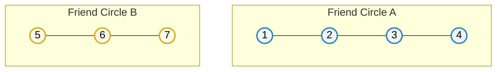

Right now, **Set A** and **Set B** are completely "disjoint" — they share no common elements.

## <span style="color: #E74C3C;">2. The Query: "Are they in the same component?"</span>

### 📌 The Problem: The DFS Brute Force
Imagine someone suddenly asks a query: *"Does node `1` and node `5` belong to the same component?"*

If you use traditional graph traversal techniques (like DFS or BFS), what would you do? You would pick node `1` and start a DFS traversal. The algorithm would go `1 → 2 → 3 → 4` and then stop. Since it could not find node `5` during this traversal, you would conclude: *"No, they do not belong to the same component."*

While this works, **what is the time complexity?** A complete DFS or BFS takes **$O(V + E)$** (where $V$ is vertices and $E$ is edges). If you have thousands of queries like this, traversing the graph every single time is an extremely slow, brute-force approach.

### ⚡ The DSU Magic: Constant Time Queries
This is exactly where the **Disjoint Set Union (DSU)** data structure steps in and says: *"Hey, I can do the same thing in constant time!"* 

Instead of walking through the entire graph edge by edge, DSU can instantly answer the query *"Do 1 and 5 belong to the same component?"* with a quick **YES or NO** in **$O(1)$** (near-constant time).

### 🌐 Practical Use Case: Dynamic Graphs
Another massive reason DSU is used is for **Dynamic Graphs**. 
What is a dynamic graph? It is a graph that keeps *changing its configuration* at every moment (e.g., new edges are constantly being added in real-time). 

If you use DFS, you would have to recalculate and traverse everything again whenever a new edge is added. DSU, on the other hand, easily and instantly manages these new connections as they happen. *(We will visualize exactly what "changing configuration" means in the later sections).*

### ⚙️ Step-by-Step Visualization: DFS Failure vs DSU

Here is a visual representation of why the DFS approach is a brute-force struggle for this query:

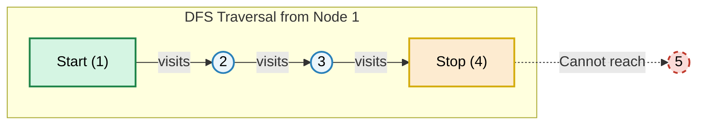

## <span style="color: #27AE60;">3. The Two Superpowers of DSU</span>

To achieve this near-constant time magic, the Disjoint Set Data Structure provides us with exactly two primary functions. Think of them as the core tools in a graph toolbox.

### 🔍 1. Find Parent (or Find Root)
**What it does:** It figures out which set or component a particular node belongs to. 
**How to think about it:** Imagine every friend circle (component) has a "Leader" or "Root Node" that represents the whole group. If you want to know if Person `1` and Person `5` are in the same friend circle, you simply ask, *"Who is your leader?"* If both points to the *same* leader, they are in the same component!

### 🔗 2. Union (Merging Sets)
**What it does:** It connects two entirely different components together into a single, unified component.
**How to think about it:** If the leader of Friend Circle A decides to make an alliance with the leader of Friend Circle B, both groups officially merge into one giant friend circle.

> 💡 **Note on Union Methods:** Merging sets must be done smartly so that the group hierarchy doesn't become a long, slow chain. To keep the structure balanced and queries incredibly fast, `Union` can be performed using two specific strategies:
> - **Union by Rank** (merging based on the tree's height/depth)
> - **Union by Size** (merging based on the total number of nodes in the tree)
> 
> *Don't worry, we will break down both of these methods step-by-step very soon!*

### ⚙️ Visualizing the Concept

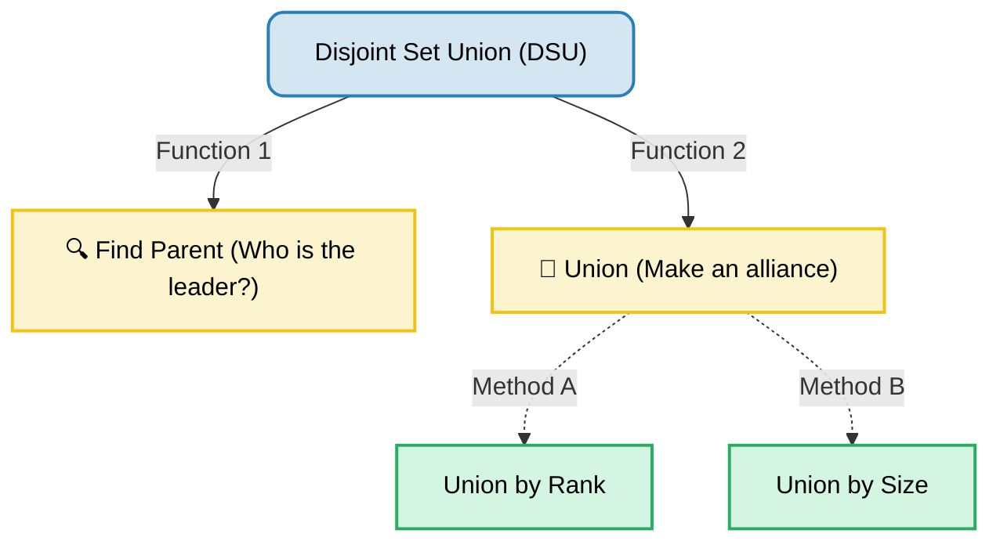

## <span style="color: #E67E22;">4. Understanding "Dynamic Graphs"</span>

Earlier, we mentioned that DSU shines in **Dynamic Graphs**. But what exactly does it mean when we say a graph is *"changing configurations at every moment"*?

### 📌 The Concept
In many traditional graph problems, you are handed the entire graph upfront on a silver platter—all nodes and edges are already fixed. But in the real world, structures are dynamic. Edges are formed one by one, in real-time. 

When we tell the DSU to perform `Union(1, 2)`, we are literally commanding: *"Connect node 1 and node 2 right now."* DSU perfectly manages and tracks these isolated components as they slowly merge together over time.

### 🌐 Practical Use Case: A Brand New Social Network
Imagine a new social media app just launched today. 
- **8:00 AM:** 7 users sign up. None of them know each other yet. Everyone is an isolated island.
- **8:05 AM:** User 1 friends User 2.
- **8:15 AM:** Group dynamics shift as more people connect.
The network is *dynamic*—its configuration is constantly shifting!

### ⚙️ Step-by-Step Visualization: The Evolution of the Graph

Let's look at exactly how a graph's configuration changes instance by instance.

#### ⏱ Time 0: Initial State (Everyone is alone)
Before any edges are formed, we have 7 separate, disconnected nodes. Every single node is its own component.


#### ⏱ Time 1: `Union(1, 2)`
Command: *"Connect 1 and 2."* 
Now, nodes 1 and 2 form a single component.

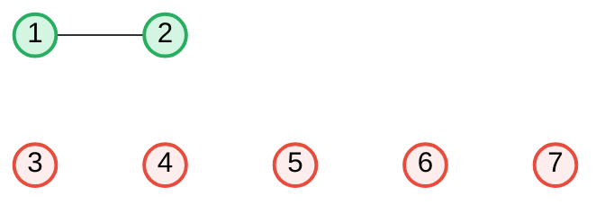

#### ⏱ Time 2: `Union(2, 3)`
Command: *"Connect 2 and 3."*
Node 3 joins the existing {1, 2} component group.

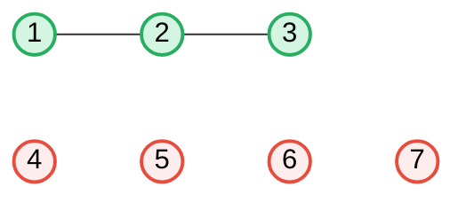

#### ⏱ Time 3: `Union(4, 5)`
Command: *"Connect 4 and 5."*
A brand new standalone component is formed far away from the {1, 2, 3} group.

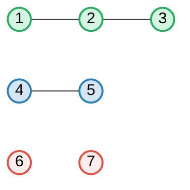

#### ⏱ Time 4: `Union(6, 7)`
Command: *"Connect 6 and 7."*
Yet another isolated component is created.

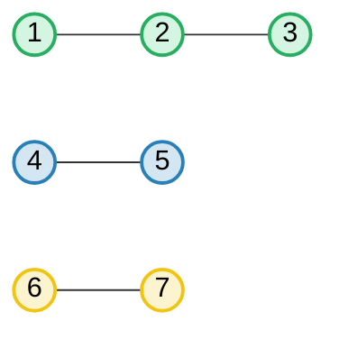

As you can clearly see, with every `Union()` operation, the graph's configuration drastically alters! DSU gracefully tracks these ever-growing connections.

## <span style="color: #9B59B6;">5. Mid-Flight Queries: The True Power of DSU</span>

What makes DSU incredible is not just that it connects things, but that it allows you to pause the clock and ask **queries at any given stage** of this ongoing formation.

### 🛑 Asking a Query in the Middle
Imagine we stop the formation exactly where we left off above (Time 4). We have three distinct groups: `{1, 2, 3}`, `{4, 5}`, and `{6, 7}`.

**Query:** *"Hey, do node 1 and node 4 belong to the same component right now?"*
**Answer:** **NO.** 
At this exact moment, Node 1 is an entirely different group from Node 4. DSU would instantly output `False`.

### ⏱ Time 5: `Union(5, 6)`
Let's resume the clock. Command: *"Connect 5 and 6."*
This operation merges the blue group and the yellow group!

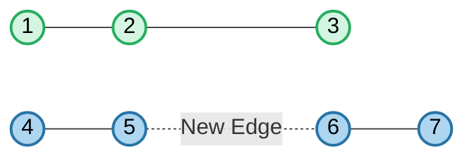

### ⏱ Time 6: `Union(3, 7)`
Command: *"Connect 3 and 7."*
This creates a massive bridge between the green group and the merged blue group.

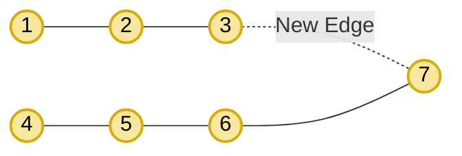

### ✅ Asking the Same Query Again!
The graph is now one giant, unified component. What happens if we ask that exact same question again?

**Query:** *"Do node 1 and node 4 belong to the same component?"*
**Answer:** **YES.**

> 💡 **The Core Takeaway:** DSU doesn't care how messy or complex the graph gets. Whether the graph is heavily fragmented or fully unified, DSU can process the query *"Are U and V connected?"* in constant time, at *any* absolute second. That is the ultimate magic of the Disjoint Set Data Structure!

---

## <span style="color: #CB4335;">6. Deep Dive: Implementing Union By Rank</span>

Now that we understand *what* DSU does, let's dive into *how* it actually works under the hood. 

In order to implement the Disjoint Set Data Structure, we need two fundamental arrays and a set of logic for our `Find Parent` and `Union` operations. As mentioned earlier, `Union` can be implemented in two ways: **Union by Rank** and **Union by Size**. 

We will start our journey with **Union by Rank**, as it perfectly illustrates how DSU keeps trees short and queries extremely fast.

### 📌 The Two Essential Arrays
To make "Union by Rank" work, we must declare two arrays of size `N+1` (assuming 1-based indexing for nodes 1 to N).

1. **`parent[]` Array:** This array keeps track of who the immediate "boss" or "parent" of a node is.
2. **`rank[]` Array:** This array keeps track of the "hierarchy" or "depth" of the tree. Initially, everyone has a rank of `0`.

### 🌱 Step 0: The Initial Configuration

In order to implement Union by Rank, we require a couple of arrays:
1. **The Rank Array:** This keeps track of the "depth" or tree height.
2. **The Parent Array:** This helps us find the root leader of a node.

Because our graph is 1-based indexed, we create arrays from index `1` to `7`.

#### What do these numbers mean initially?
- **Rank = 0:** Initially, assigning `rank[i] = 0` means there are *zero nodes beneath it*. It's a single, standalone node. (However, later when we apply optimizations like Path Compression, the literal meaning of rank will change slightly, but it will still represent the relative depth).
- **Parent = Itself:** Before any edges are formed, everyone is alone. This means **everyone is the parent of themselves**. The parent of `1` is `1`, the parent of `2` is `2`, and so on.

#### Visualizing the Arrays

**Rank Array:**
| Index (Node) | 1 | 2 | 3 | 4 | 5 | 6 | 7 |
|:---:|:---:|:---:|:---:|:---:|:---:|:---:|:---:|
| **Rank** | 0 | 0 | 0 | 0 | 0 | 0 | 0 |

**Parent Array:**
| Index (Node) | 1 | 2 | 3 | 4 | 5 | 6 | 7 |
|:---:|:---:|:---:|:---:|:---:|:---:|:---:|:---:|
| **Parent** | 1 | 2 | 3 | 4 | 5 | 6 | 7 |

#### Visualizing the Disconnected Graph
Since no `Union` operations have been performed yet, all nodes are completely disconnected:


---

## <span style="color: #2980B9;">7. The 3 Golden Rules of Union by Rank</span>

To perform `Union(u, v)`, you must strictly follow these three steps:

**Step 1: Find the Ultimate Parent.** 
Find the ultimate parent of node `u` and node `v`. Let's call them **PU** (Ultimate Parent of u) and **PV** (Ultimate Parent of v). 
*(What is an ultimate parent? If you have a bunch of nodes connected in a tree-like chain, the guy sitting at the very top is the ultimate parent!)*

**Step 2: Find the Rank of the Ultimate Parents.**
Look up the rank of `PU` and `PV` from our array. 
*(❗️ Warning: Always check the rank of the ultimate parents, NOT the raw nodes `u` and `v` themselves!)*

**Step 3: Connect Smaller Rank to Larger Rank.**
- If `rank[PU] < rank[PV]`, connect `PU` under `PV`.
- If `rank[PV] < rank[PU]`, connect `PV` under `PU`.
- **Tie-breaker:** If both ranks are exactly equal, you can connect anyone to anyone (it is completely your choice). However, because two trees of the exact same height are merging, **the height of the new overall parent will increase by 1**.

---

## <span style="color: #8E44AD;">8. Executing the Operations (Step-by-Step)</span>

We have a target list of edges we want to form dynamically. Let's apply our 3 golden rules and execute them one by one!

**📋 Operation Tracker:**
- [x] `Union(1, 2)` (Completed)
- [x] `Union(2, 3)` (Completed)
- [x] `Union(4, 5)` (Completed)
- [x] `Union(6, 7)` (Completed)
- [x] `Union(5, 6)` (Completed)
- [ ] `Union(3, 7)`

---

### 🟢 Operation 1: `Union(1, 2)`

We want to connect node `1` and node `2`.

1. **Find Ultimate Parents:** 
   - `PU` of 1 is **1** (Since `parent[1] = 1`).
   - `PV` of 2 is **2** (Since `parent[2] = 2`).
2. **Find Ranks:** 
   - `rank[1]` is **0**.
   - `rank[2]` is **0**.
3. **Connect & Update:** 
   - Because both ranks are equal (`0 == 0`), we can connect anyone to anyone. Let's choose to connect node `2` *under* node `1`. 
   - Now, node `1` becomes the boss! So we update `parent[2] = 1`.
   - Since they were of equal height and we merged them, the total height increases. So, the rank of the new boss (node 1) increases by 1. `rank[1] = 1`.

#### 📊 Array Update after `Union(1, 2)`

**Rank Array:**
| Index (Node) | 1 | 2 | 3 | 4 | 5 | 6 | 7 |
|:---:|:---:|:---:|:---:|:---:|:---:|:---:|:---:|
| **Rank** | **<span style="color: #27AE60;">1</span>** | 0 | 0 | 0 | 0 | 0 | 0 |

**Parent Array:**
| Index (Node) | 1 | 2 | 3 | 4 | 5 | 6 | 7 |
|:---:|:---:|:---:|:---:|:---:|:---:|:---:|:---:|
| **Parent** | 1 | **<span style="color: #27AE60;">1</span>** | 3 | 4 | 5 | 6 | 7 |

#### ⚙️ Visualizing the DSU Tree after `Union(1, 2)`

Node `2` is now officially connected to node `1`, and node `1` sits at the top as the ultimate parent.

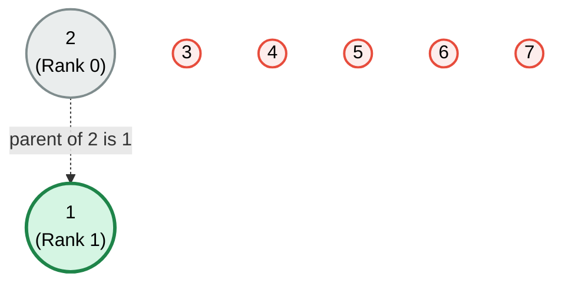

---

### 🟢 Operation 2: `Union(2, 3)`

Next, we want to connect node `2` and node `3`.

1. **Find Ultimate Parents:** 
   - To find `PU` of 2, we check `parent[2]` which is **1**. Since `1` is the top guy, **1** is the Ultimate Parent.
   - `PV` of 3 is **3** (Since `parent[3] = 3`).
2. **Find Ranks:** 
   - `rank[1]` is **1**. *(❗️ Remember: We strictly check the rank of the ultimate parent, and not the rank of node 2 itself!)*
   - `rank[3]` is **0**.
3. **Connect & Update:** 
   - Here, `rank[1] > rank[3]` (1 > 0). According to our rule, the **smaller rank connects to the larger rank**.
   - So, node `3` (the smaller guy) comes and connects *under* node `1` (the larger guy). We update `parent[3] = 1`.
   - **Does the rank increase? NO.** Because we attached a smaller tree (height 0) under a taller tree (height 1), the overall height of the tree remains unchanged at 1.

#### 📊 Array Update after `Union(2, 3)`

**Rank Array:**
| Index (Node) | 1 | 2 | 3 | 4 | 5 | 6 | 7 |
|:---:|:---:|:---:|:---:|:---:|:---:|:---:|:---:|
| **Rank** | <span style="color: #27AE60;">1</span> | 0 | 0 | 0 | 0 | 0 | 0 |

*(Notice that the Rank Array has not changed at all in this step.)*

**Parent Array:**
| Index (Node) | 1 | 2 | 3 | 4 | 5 | 6 | 7 |
|:---:|:---:|:---:|:---:|:---:|:---:|:---:|:---:|
| **Parent** | 1 | <span style="color: #27AE60;">1</span> | **<span style="color: #27AE60;">1</span>** | 4 | 5 | 6 | 7 |

#### ⚙️ Visualizing the DSU Tree after `Union(2, 3)`

Node `3` connects directly to the ultimate parent `1`. The maximum height of the tree is still 1.

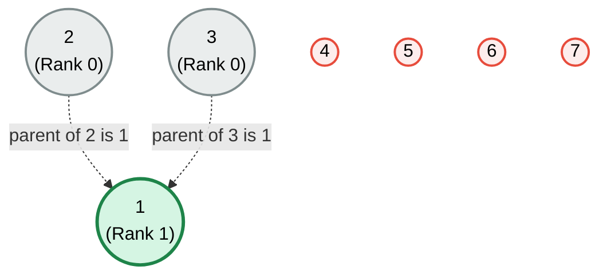

---

### 🟢 Operation 3: `Union(4, 5)`

Now, we shift our focus to a completely disconnected part of the graph and connect `4` and `5`.

1. **Find Ultimate Parents:** 
   - `PU` of 4 is **4** (Since `parent[4] = 4`).
   - `PV` of 5 is **5** (Since `parent[5] = 5`).
2. **Find Ranks:** 
   - `rank[4]` is **0**.
   - `rank[5]` is **0**.
3. **Connect & Update:** 
   - Since both ranks are exactly the same (`0 == 0`), we can connect anyone to anyone. Let's completely follow your note and connect node `5` *under* node `4`.
   - Node `4` becomes the new boss for this component. We update `parent[5] = 4`.
   - Because they were of equal height and merged, the height of the new boss increases by 1. We update `rank[4] = 1`.

#### 📊 Array Update after `Union(4, 5)`

**Rank Array:**
| Index (Node) | 1 | 2 | 3 | 4 | 5 | 6 | 7 |
|:---:|:---:|:---:|:---:|:---:|:---:|:---:|:---:|
| **Rank** | 1 | 0 | 0 | **<span style="color: #27AE60;">1</span>** | 0 | 0 | 0 |

**Parent Array:**
| Index (Node) | 1 | 2 | 3 | 4 | 5 | 6 | 7 |
|:---:|:---:|:---:|:---:|:---:|:---:|:---:|:---:|
| **Parent** | 1 | 1 | 1 | 4 | **<span style="color: #27AE60;">4</span>** | 6 | 7 |

#### ⚙️ Visualizing the DSU Tree after `Union(4, 5)`

A brand new component is formed! Node `5` connects to `4`, and we now have two separate structural trees in our graph.

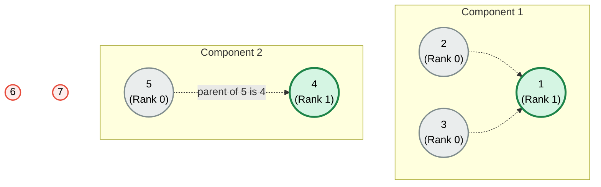

---

### 🟢 Operation 4: `Union(6, 7)`

Continuing the same logic, we now connect the last two isolated nodes: `6` and `7`.

1. **Find Ultimate Parents:** 
   - `PU` of 6 is **6** (Since `parent[6] = 6`).
   - `PV` of 7 is **7** (Since `parent[7] = 7`).
2. **Find Ranks:** 
   - `rank[6]` is **0**.
   - `rank[7]` is **0**.
3. **Connect & Update:** 
   - Ranks are equal (`0 == 0`). We connect node `7` *under* node `6`.
   - Node `6` becomes the new boss. We update `parent[7] = 6`.
   - Because equal ranks merged, the new boss `6` gets a rank bump. We update `rank[6] = 1`.

#### 📊 Array Update after `Union(6, 7)`

**Rank Array:**
| Index (Node) | 1 | 2 | 3 | 4 | 5 | 6 | 7 |
|:---:|:---:|:---:|:---:|:---:|:---:|:---:|:---:|
| **Rank** | 1 | 0 | 0 | 1 | 0 | **<span style="color: #27AE60;">1</span>** | 0 |

**Parent Array:**
| Index (Node) | 1 | 2 | 3 | 4 | 5 | 6 | 7 |
|:---:|:---:|:---:|:---:|:---:|:---:|:---:|:---:|
| **Parent** | 1 | 1 | 1 | 4 | 4 | 6 | **<span style="color: #27AE60;">6</span>** |

#### ⚙️ Visualizing the DSU Tree after `Union(6, 7)`

Now we have three entirely distinct components in our graph! Every single node is now part of some group.

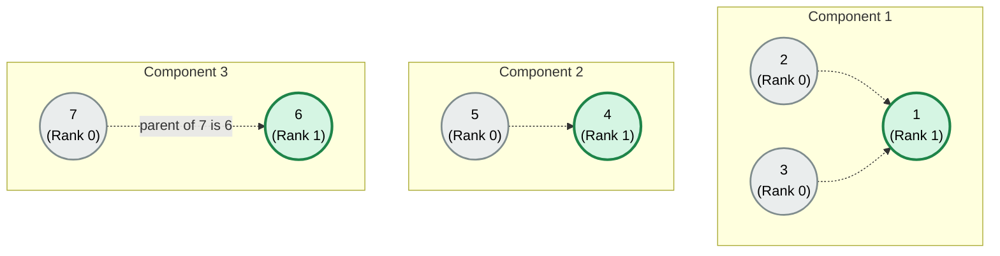

---

### 🟢 Operation 5: `Union(5, 6)`

This is where it gets really interesting! We are going to connect node `5` from Component 2 and node `6` from Component 3.

**📋 Current Tracker State:**
- [x] `Union(1, 2)`
- [x] `Union(2, 3)`
- [x] `Union(4, 5)`
- [x] `Union(6, 7)`
- [x] `Union(5, 6)` 👈 **(We are here)**
- [ ] `Union(3, 7)`

#### 🔍 Before Attachment: Identifying the Leaders
First, let's look at the two separate components before we merge them, and figure out who their ultimate bosses are.

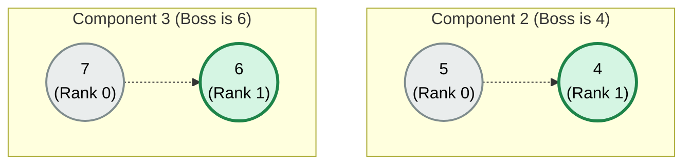

1. **Find Ultimate Parents:** 
   - `PU` of 5: 5 is here. 5's parent is 4. Who is actually the top boss? It's **4**.
   - `PV` of 6: 6's parent is 6 himself. So the ultimate top boss is **6**.
2. **Find Ranks:** 
   - `rank[4]` is **1**.
   - `rank[6]` is **1**.

*We have someone of the same ranks (`r=1` and `r=1`)! So either `6` can go and get attached to `4`, or `4` can go and get attached to `6`. You can do as you wish.*

#### 🔗 After Attachment: Merging the Trees

Let's go ahead and take the `6` and make it attached to `4`.

3. **Connect & Update:** 
   - We attach `6` to `4`. So, the parent of 6 will be 4. We update `parent[6] = 4`. Remember this very well!
   - What is the other thing you will do? You will have to increase the rank! Why? Because you had `{4, 5}` and you got `{6, 7}`. `4` and `6` both had a rank of 1 (same guys). Since you attached trees of the same height, the overall height increased!
   - We update the rank of the new ultimate boss `4` by one more. `rank[4] = 2`.

#### 📊 Array Update after `Union(5, 6)`

**Rank Array:**
| Index (Node) | 1 | 2 | 3 | 4 | 5 | 6 | 7 |
|:---:|:---:|:---:|:---:|:---:|:---:|:---:|:---:|
| **Rank** | 1 | 0 | 0 | **<strike>1</strike> <span style="color: #CB4335;">2</span>** | 0 | 1 | 0 |

**Parent Array:**
| Index (Node) | 1 | 2 | 3 | 4 | 5 | 6 | 7 |
|:---:|:---:|:---:|:---:|:---:|:---:|:---:|:---:|
| **Parent** | 1 | 1 | 1 | 4 | 4 | **<strike>6</strike> <span style="color: #CB4335;">4</span>** | 6 |

#### ⚙️ Visualizing the DSU Tree after `Union(5, 6)`

Component 2 and Component 3 have now officially merged into a single taller tree under node `4`.

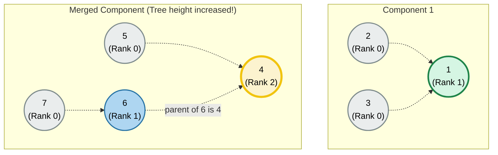

---

## <span style="color: #9B59B6;">9. The Importance of the Ultimate Boss (And a Hidden Problem!)</span>

Before we move to our final operation, suddenly someone comes up and asks a question:
**Query:** *"Do node 1 and node 7 belong to the same component right now?"*

If we look at their ultimate parents:
- `PU` of 1 is **1**.
- `PU` of 7 is **4**. (Because: `parent[7]` is 6 -> `parent[6]` is 4 -> `parent[4]` is 4).
The parents are different. So the answer is **NO**.

### ⚠️ The Trap of the "Immediate" Parent
Now, let's step outside our exact edge list for a second and imagine a hypothetical scenario. Imagine we didn't just have `{1...7}`, we also had a node `8`. Imagine node `8` was attached under `5`!

**Query:** *"Do node 8 and node 7 belong to the same component?"*

If you answer this *only* by looking at their immediate parents in the array:
- `parent[8]` is `5`.
- `parent[7]` is `6`.
- *Hey, 5 and 6 are different numbers! They must not be in the same component!*

**WRONG!** ❌ 
Take a look at the tree visualization of this hypothetical scenario (similar to the image):

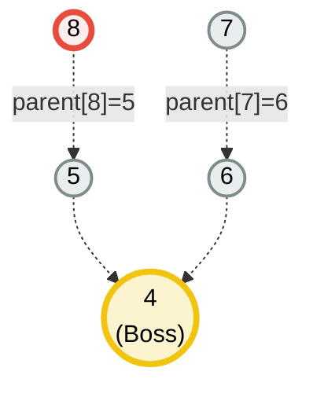

Do they belong to the same component? **Yes!** They clearly trace back to the same top boss (`4`). 

> 💡 **CRITICAL LESSON:** This is a Disjoint Set Tree, NOT just drawing a graph. You **CANNOT** tell if two nodes are in the same component based on their immediate parents. You **NEED** the ultimate boss. 
> To find the boss of `7`: You go `7` -> see `6` -> go `6` -> see `4` -> go `4` -> see `4` -> *"Oh, I am the boss, my parent is me!"* Therefore, `PU = 4`.

### ⏳ The Hidden Problem: Increasing Depth!
Because we need the *Ultimate Parent* to correctly answer queries, an issue starts to appear.
Since we are creating a tree structure, **with more and more edge additions, the tree will increase in depth!** The tree will keep going down, down, down...

If the tree becomes extremely tall, going from node `1000` all the way up to node `4` step-by-step will end up taking **logarithmic time ($O(\log N)$)** or worse. 

But wait—didn't we promise DSU answers queries in **constant time ($O(1)$)**? Yes, it does! And it achieves this using a brilliant technique called **Path Compression**.

---

## <span style="color: #F39C12;">10. The Ultimate Optimization: Path Compression</span>

Let's look back at our node `7`. Let's say someone asks us to find the ultimate parent of `7`.

### 🚶‍♂️ The Long Journey (Without Compression)
To find the boss, you start at `7`:
1. You go to `7`'s parent: `6`.
2. You go to `6`'s parent: `4`.
3. You go to `4`'s parent: `4` (He is the boss!).

Congratulations, you figured out that `PU = 4`! But that took multiple steps. 

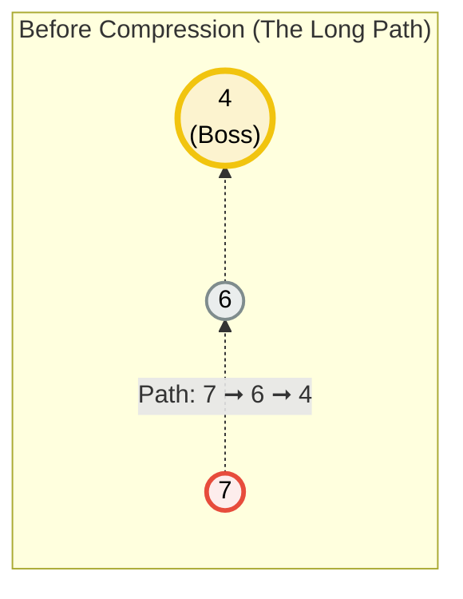

### ⚡ The Genius Idea: "Save the State!"
DSU says: *"Listen, I just did all this hard work walking from 7 to 6 to 4. I now know that 7's ultimate boss is 4. Why should I keep 7 attached to 6?"*

**I don't need the intermediate link anymore!** 
Since our only goal is to quickly find the ultimate parent, we can just safely bypass `6` and take node `7` to **connect it directly to node `4`**. We literally *compress the path*!

We update the array state to reflect this newfound shortcut: `parent[7] = 4`.

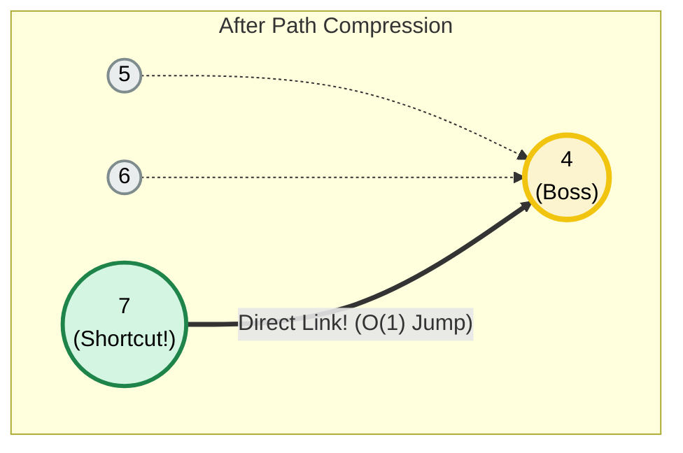

### 🚀 Why is this mind-blowing?
Let's say a minute later, someone asks the query again: *"Do node 2 and node 7 belong to the same component?"*

You call `Find Parent` for `7`. This time, you don't have to travel `7 ➞ 6 ➞ 4`. You start at `7`, ask who its parent is, and **BOOM**—it instantly points directly to `4`! You found the boss in just **ONE single jump ($O(1)$ constant time)**.

By dynamically rewiring pointers directly to the ultimate boss on our way back up, DSU constantly "flattens" the tree. This ensures that no matter how complex the graph becomes, finding the boss remains terrifyingly fast.

---

### 🤯 The Extreme Recursive Example
Imagine a much taller, worst-case tree structure: `1 <- 2 <- 3 <- 4 <- 5`. (Node `1` is the absolute Boss).

```mermaid
graph TD
    classDef superBoss fill:#FCF3CF,stroke:#F1C40F,stroke-width:4px,color:#000000;
    classDef midBoss fill:#EAEDED,stroke:#7F8C8D,stroke-width:2px,color:#000000;
    classDef targetRed fill:#FDEDEC,stroke:#E74C3C,stroke-width:3px,color:#000000;

    subgraph Step_1__The_Extremely_Tall_Tree ["Step 1: The Extremely Tall Tree"]
        direction BT
        1(("1<br>(Boss)")):::superBoss
        2(("2")):::midBoss
        3(("3")):::midBoss
        4(("4")):::midBoss
        5(("5")):::targetRed

        2 --> 1
        3 --> 2
        4 --> 3
        5 --> 4
    end
```

Someone asks: **"Find the parent of 5!"**
Here is what happens during the recursive `Find Parent` call and the magical backtracking:
1. `5` goes to `4`, `4` goes to `3`, `3` goes to `2`, `2` goes to `1`.
2. `1` says: *"I am the parent!"* and returns `1` back to `2`.
3. The recursion backtracks to `3`. `3` receives `1` and realizes: *"Wait! My ultimate parent is 1! Why am I wasting time connecting to 2?"* -> `3` rewires itself to `1`.
4. The recursion backtracks to `4`. `4` gets `1` and thinks: *"Why waste time connecting to 3?"* -> `4` rewires to `1`.
5. Finally, back at `5`. `5` gets `1` and rewires directly to `1`.

**The result?** The entire path gets compressed on the way back up! Everyone in the path who was visited (`2, 3, 4, 5`) abandons their intermediate parents and directly attaches to `1`!

```mermaid
graph TD
    subgraph Step_2__Star_Graph_after_Backtracking_ ["Step 2: Star Graph after Backtracking!"]
        1(("1<br>(Boss)")):::superBoss
        2(("2")):::midBoss
        3(("3<br>(Rewired!)")):::midBoss
        4(("4<br>(Rewired!)")):::midBoss
        5(("5<br>(Rewired!)")):::midBoss
        
        2 --> 1
        3 == "Direct Link!" ==> 1
        4 == "Direct Link!" ==> 1
        5 == "Direct Link!" ==> 1
    end

    classDef superBoss fill:#FCF3CF,stroke:#F1C40F,stroke-width:4px,color:#000000;
    classDef midBoss fill:#EAEDED,stroke:#7F8C8D,stroke-width:2px,color:#000000;
```

**Next Time:** If anyone ever asks for the parent of `3`, `4`, or `5`, they don't need to traverse anything. They are all just **one step away** from the ultimate boss! This single mechanism magically transforms graph querying from $O(N)$ to practically $O(1)$.

---

## <span style="color: #8E44AD;">11. Back to Reality: Our Current Graph State</span>

We've learned the deep dive behind finding the Ultimate Parent and the magic of Path Compression. Now, let's step back to our original edge list and see exactly where we stand. 

If you recall, we had just finished executing `Union(5, 6)` right before our theoretical detour. 

Our operations checklist:
- [x] `Union(1, 2)`
- [x] `Union(2, 3)`
- [x] `Union(4, 5)`
- [x] `Union(6, 7)`
- [x] `Union(5, 6)`
- **[ ] `Union(3, 7)`** ⬅️ The Final Showdown!

Based on all the `Union()` and `findParent()` logic we've traced, here is the current shape of our forest right before this last step:

```mermaid
graph TD
    classDef superBoss fill:#FCF3CF,stroke:#F1C40F,stroke-width:4px,color:#000000;
    classDef midBoss fill:#EAEDED,stroke:#7F8C8D,stroke-width:2px,color:#000000;

    subgraph Component_1 ["Component 1"]
        1(("1<br>(Boss)")):::superBoss
        2(("2")):::midBoss
        3(("3")):::midBoss
        2 --> 1
        3 --> 1
    end

    subgraph Component_2 ["Component 2"]
        4(("4<br>(Boss)")):::superBoss
        5(("5")):::midBoss
        6(("6")):::midBoss
        7(("7")):::midBoss
        5 --> 4
        6 --> 4
        7 --> 6
    end
```

*(Notice how node `7` is currently attached to `6`. If we actually code this and call `findParent(7)` during the final step, it will travel to `6`, then `4`, and Path Compression will snap its pointer directly to `4`!)*

---

### 🏁 Operation 6: `Union(3, 7)` 
This is our final edge. We want to connect node `3` and node `7`.

1. **Find Ultimate Parents (with Path Compression!):** 
   - `PU` of 3: We check `parent[3]`. It is `1`. Node `1` is the absolute boss. So, `PU = 1`. *(Very easily found, as `3` is directly attached to `1`)*.
   - `PU` of 7: We check `parent[7]`. It is `6`. 
     - We check `parent[6]`. It is `4`.
     - We check `parent[4]`. It is `4`. Boss found!
     - **PATH COMPRESSION TRIGGERED!** We say, *"Wait, why is 7 still pointing at 6? Let's attach 7 directly to 4!"*
     - We update `parent[7] = 4`. So `PU = 4`.

```mermaid
graph TD
    subgraph Path_Compression_on_Node_7 ["Path Compression on Node 7"]
        4(("4<br>(Boss PU=4)")):::superBoss
        5(("5")):::midBoss
        6(("6")):::midBoss
        7(("7<br>(Compressed!)")):::targetRed
        
        5 --> 4
        6 --> 4
        7 -. "was attached to 6" .-> 6
        7 == "Now directly points to 4" ==> 4
    end

    classDef superBoss fill:#FCF3CF,stroke:#F1C40F,stroke-width:4px,color:#000000;
    classDef midBoss fill:#EAEDED,stroke:#7F8C8D,stroke-width:2px,color:#000000;
    classDef targetRed fill:#D5F5E3,stroke:#1E8449,stroke-width:3px,color:#000000;
```

2. **Find Ranks:**
   - `rank[1]` (Boss of Component 1) is **1**.
   - `rank[4]` (Boss of Component 2) is **2**.
   
3. **Connect & Update:**
   - Are the ranks equal? No! `rank[4]` is greater than `rank[1]`.
   - Rule 2 kicks in: **Smaller connects to the Larger.** 
   - Node `1` gets attached under node `4`.
   - We update `parent[1] = 4`.
   - *Does the rank increase?* No! Because `4` was already taller (rank 2) and `1` was shorter (rank 1). Node `1` just safely tucks underneath `4` without increasing `4`'s overall height.

#### 📊 Final Array State after `Union(3, 7)`

Notice two vital changes here: `parent[1]` became `4` due to the union, and `parent[7]` became `4` due to Path Compression!

**Rank Array:** (No change in ranks here!)
| Index (Node) | 1 | 2 | 3 | 4 | 5 | 6 | 7 |
|:---:|:---:|:---:|:---:|:---:|:---:|:---:|:---:|
| **Rank** | 1 | 0 | 0 | **2** | 0 | 1 | 0 |

**Parent Array:**
| Index (Node) | 1 | 2 | 3 | 4 | 5 | 6 | 7 |
|:---:|:---:|:---:|:---:|:---:|:---:|:---:|:---:|
| **Parent** | **<strike>1</strike> <span style="color: #CB4335;">4</span>** | 1 | 1 | 4 | 4 | 4 | **<strike>6</strike> <span style="color: #27AE60;">4</span>** |

#### 🌳 Visualizing the Final DSU Tree (Just like your drawing!)
The entire network is now a single, optimized component under the reign of Boss `4`. Notice how node `1` (along with `2` and `3` still attached underneath it) moves over and points directly to `4`.

```mermaid
graph BT
    classDef superBoss fill:#FCF3CF,stroke:#F1C40F,stroke-width:4px,color:#000000;
    classDef midBoss fill:#AED6F1,stroke:#2874A6,stroke-width:2px,color:#000000;
    classDef child fill:#EAEDED,stroke:#7F8C8D,stroke-width:2px,color:#000000;
    classDef highlight fill:#D5F5E3,stroke:#1E8449,stroke-width:3px,color:#000000;

    4(("4<br>(Boss PU=4)")):::superBoss
    
    1(("1")):::midBoss
    5(("5")):::child
    6(("6")):::child
    7(("7<br>(Compressed)")):::highlight
    
    2(("2")):::child
    3(("3")):::child

    %% Connections reflecting exactly the final drawn state
    1 == "Union" ==> 4
    5 --> 4
    6 --> 4
    7 == "Path Compressed" ==> 4

    %% Connections to Old Boss 1
    2 --> 1
    3 --> 1
```

🎉 And that's it! By consistently tracing the parents, compressing the paths in real-time, and merging by rank, we built a highly optimized forest that can answer queries perfectly!

---

## <span style="color: #E67E22;">12. The Burning Question: Why "Rank" instead of "Height"?</span>

If you are paying very close attention to our final graph, you might have noticed a paradox. 
After Path Compression on node `7`, the longest path in that branch shrank. But if you look at our `rank` array, **the rank of 4 is still `2`!** We did not decrease it.

Wait, if the tree shortened, shouldn't we decrease the rank? **No, we cannot!**

### 🧐 The Reason: Uneven Compression
When we perform Path Compression, we only compress the *specific path* we are traveling. We have no idea what the rest of the tree looks like.

Imagine a scenario where Boss `4` has multiple branches, like this:
- Branch A: `4 ➞ 5 ➞ 6`
- Branch B: `4 ➞ 7 ➞ 8`

```mermaid
graph TD
    subgraph Uneven_Compression_Problem ["Uneven Compression Problem"]
        4(("4<br>(Boss Rank 2)")):::superBoss
        5((5)):::midBoss
        6((6)):::midBoss
        7((7)):::midBoss
        8((8)):::midBoss

        4 --> 5 --> 6
        4 --> 7 --> 8
    end

    classDef superBoss fill:#FCF3CF,stroke:#F1C40F,stroke-width:4px,color:#000000;
    classDef midBoss fill:#EAEDED,stroke:#7F8C8D,stroke-width:2px,color:#000000;
```

Now, what if someone asks for `findParent(6)`? 
You will follow `6 ➞ 5 ➞ 4`, and Path Compression will attach `6` directly to `4`. 

*Did that specific section of the tree shorten?* Yes! 
*Did the **overall** tree height shrink?* **No!** Because the `4 ➞ 7 ➞ 8` branch is still completely untouched and long!

If we blindly reduced Boss `4`'s rank just because we compressed one single path, our rank tracking would be dangerously incorrect. To figure out the *actual* new height of the tree, we would have to traverse every single node and branch. Checking the whole tree takes $O(N)$ time, which completely ruins the $O(1)$ magic of DSU!

### 💡 The Verdict: Rank is just a Label!
Because the value might not reflect the actual current height of the tree after path compressions, we **DO NOT call it Height**. We call it **`Rank`**. 

"Rank" is simply a relative score. It just means: *"Historically, this guy accumulated more levels than the other guy."* It acts as an upper-bound heuristic—a smart, lazy approximation that perfectly tells us which tree is generally "bigger" when we need to merge two components. That's all we need!

> **📌 Final Word Summary:** 
> When we did `Union(3, 7)`, node `1` (which had a rank of 1) and its children (`2` and `3`) got attached to node `4` (which had a rank of 2). 
> **Did the rank change? NO!** Attaching a smaller tree to a larger tree does not impact the overall rank of the larger tree. And we specifically say *rank* instead of *height*, **because during path compression, the height will shrink, but we do not dynamically shrink the rank.** This is how cleverly and easily DSU maintains its near-$O(1)$ efficiency!

---

## <span style="color: #2E86C1;">13. One Last Query: The Domino Effect of Compression</span>

Right after that massive union, someone throws a query at you:
**Query:** *"Hey, do node 3 and node 6 belong to the same component now?"*

Let's trace exactly what happens:

1. **Find Parent of 3:**
   - You go to `3`. Its immediate parent is `1`.
   - You go to `1`. Due to our last union, `1`'s parent is now `4`.
   - You go to `4`. `4` is the ultimate boss.
   - **Path Compression Happens Again!** As you backtrack, you tell node `3`: *"Hey, your ultimate boss is 4. Don't waste time going through 1 anymore!"* 
   - `3` detaches from `1` and connects **directly to `4`**!

2. **Find Parent of 6:**
   - You go to `6`. Its parent is already `4` (from our earlier operations).
   - Boss found directly!

Since both `findParent(3)` and `findParent(6)` returned `4`, **YES**, they belong to the same component!

### 🌲 The Graph's Final Form
Notice how node `3` has now been compressed and points straight to `4` (just like the drawn image)! Because we are continuously compressing, the tree shape stays incredibly flat.

```mermaid
graph BT
    classDef superBoss fill:#FCF3CF,stroke:#F1C40F,stroke-width:4px,color:#000000;
    classDef midBoss fill:#AED6F1,stroke:#2874A6,stroke-width:2px,color:#000000;
    classDef child fill:#EAEDED,stroke:#7F8C8D,stroke-width:2px,color:#000000;
    classDef highlight fill:#D5F5E3,stroke:#1E8449,stroke-width:3px,color:#000000;

    4(("4<br>(Boss PU=4)")):::superBoss
    
    1(("1")):::midBoss
    5(("5")):::child
    6(("6")):::child
    7(("7<br>(Compressed)")):::child
    
    2(("2")):::child
    3(("3<br>(Newly Compressed!)")):::highlight

    %% Direct connections to 4
    1 == "Union" ==> 4
    5 --> 4
    6 --> 4
    7 --> 4
    3 == "Path Compressed!" ==> 4
    
    %% Remaining old connection
    2 --> 1
```

---

## <span style="color: #E74C3C;">14. The Burning Question: Why Connect Smaller Rank to Larger Rank?</span>

You might be wondering: *"In Step 3 of our Golden Rules, why do we strictly connect the smaller rank under the larger rank? What happens if we do the opposite?"*

> 💡 **The Core Goal:** We want to keep the tree as **flat and short** as possible. A taller tree means a longer distance to travel to find the "Ultimate Boss". If the tree gets too tall, our $\mathcal{O}(1)$ magic starts slipping away!

Let's visualize the whiteboard scenario to see the massive difference between the two approaches.

### 📌 The Setup
Imagine we have two separate sets (trees):
- **Tree A (Smaller Rank):** Node `1` is the boss of `2`. (A very short tree).
- **Tree B (Larger Rank):** Node `3` is the boss of `4`, `5`, and `6`. (A taller tree).

```mermaid
graph TD
    subgraph Tree_A__Smaller_Rank_ ["Tree A (Smaller Rank)"]
        1(("1<br>(Boss)")):::superBoss
        2((2)):::child
        2 -.-> 1
    end

    subgraph Tree_B__Larger_Rank_ ["Tree B (Larger Rank)"]
        3(("3<br>(Boss)")):::superBoss
        4((4)):::midBoss
        5((5)):::midBoss
        6((6)):::child
        4 -.-> 3
        5 -.-> 4
        6 -.-> 5
    end

    classDef superBoss fill:#FCF3CF,stroke:#F1C40F,stroke-width:4px,color:#000000;
    classDef midBoss fill:#EAEDED,stroke:#7F8C8D,stroke-width:2px,color:#000000;
    classDef child fill:#EBF5FB,stroke:#2980B9,stroke-width:2px,color:#000000;
```

### ❌ Scenario A: The Bad Way (Connecting Larger under Smaller)
What if we disobey the rule and connect the larger Tree B *under* the smaller Tree A? That means we make `1` the boss of `3`.

```mermaid
graph TD
    %% The Bad Merge
    1(("1<br>(Wrong Boss!)")):::highlight
    2((2)):::child
    3(("3")):::midBoss
    4((4)):::midBoss
    5((5)):::midBoss
    6((6)):::child
    
    2 -.-> 1
    3 == "Large joined under Small" ==> 1
    4 -.-> 3
    5 -.-> 4
    6 -.-> 5

    classDef highlight fill:#FADBD8,stroke:#C0392B,stroke-width:3px,color:#000000;
    classDef midBoss fill:#EAEDED,stroke:#7F8C8D,stroke-width:2px,color:#000000;
    classDef child fill:#EBF5FB,stroke:#2980B9,stroke-width:2px,color:#000000;
```

**The Result: "The Domino Effect"** 
The entire height of the tree increases drastically! 
- To find the ultimate parent of `6`, it now has to travel a painstakingly long path: `6 ➔ 5 ➔ 4 ➔ 3 ➔ 1`. 
- The majority of the nodes (3, 4, 5, 6) now suffer increased travel time. We penalized the larger group just to accommodate the smaller group!

### ✅ Scenario B: The Smart Way (Connecting Smaller under Larger)
Now, let's follow the Golden Rule: connect the smaller Tree A under the larger Tree B. Here, Node `3` absorbs Node `1`.

```mermaid
graph TD
    %% The Good Merge
    3(("3<br>(Ultimate Boss)")):::superBoss
    4((4)):::midBoss
    5((5)):::midBoss
    6((6)):::child
    
    1(("1")):::midBoss
    2((2)):::child
    
    1 == "Small joined under Large" ==> 3
    4 -.-> 3
    5 -.-> 4
    6 -.-> 5
    2 -.-> 1

    classDef superBoss fill:#FCF3CF,stroke:#F1C40F,stroke-width:4px,color:#000000;
    classDef midBoss fill:#EAEDED,stroke:#7F8C8D,stroke-width:2px,color:#000000;
    classDef child fill:#EBF5FB,stroke:#2980B9,stroke-width:2px,color:#000000;
```

**The Result:** The magnificent thing here is that **the overall height of the tree did NOT increase!**
- The travel time for `6`, `5`, and `4` remains exactly the same as before. They are completely unaffected.
- Yes, the distance for `1` and `2` increased slightly (e.g., `2 ➔ 1 ➔ 3`), but since this was the *smaller* tree, we localized the travel time increase to the absolute minimum number of nodes possible.

### 🏁 Summary: The Two Golden Reasons
To summarize everything we just visualized, we **always attach the smaller rank to the larger rank** for two ultimate reasons:
1. **To keep the tree shrinked (flatter):** It prevents the overall height of the tree from increasing unnecessarily.
2. **To minimize travel time:** It ensures that the time taken to find the ultimate parents for the vast majority of the nodes remains as minimal as possible.

---

## <span style="color: #C0392B;">15. Time Complexity: The Magic of $O(4\alpha)$</span>

Because we constantly dynamically compress the tree, its height is strictly limited. Whenever we query for a parent, we only do a very limited number of backward traversals. 

So, what is the actual mathematical Time Complexity for the `Union()` and `findParent()` operations?

It is **$\mathcal{O}(4\alpha)$** (where $\alpha$ is the Inverse Ackermann function).

### 🎓 Interview Tip!
You DO NOT need to know the huge mathematical derivation behind $4\alpha$ for interviews! 
Here is what you need to tell your interviewer:
- The value of $\alpha$ (Inverse Ackermann function) grows so unimaginably slowly that for all practical values of $N$ (even if $N$ is the number of atoms in the universe), $\alpha \le 4$.
- Therefore, $4\alpha$ is basically a constant.
- For all practical purposes, you can confidently say: **"Because of Path Compression and Union by Rank, the time complexity of DSU operations is essentially $\mathcal{O}(1)$ or Constant Time."**

### 💾 Space Complexity
The Space Complexity of the DSU data structure is exactly **$\mathcal{O}(N)$**. 
- We declare a `parent` array of size $N+1$.
- We declare a `rank` (or `size`) array of size $N+1$.
Since we are only continuously updating these linear arrays and the recursive call stack height is bound to $O(\log N)$ or heavily compressed, the overarching space entirely depends on storing the states of these $N$ nodes. Thus, $\mathcal{O}(N)$.

---

## <span style="color: #27AE60;">16. The Code: Bringing DSU to Life in C++</span>

You might be thinking: *"How do we actually write the code for Path Compression? It looks scary to traverse and rewire all those links!"*

It is actually incredibly simple and requires just **two lines of code** inside a recursive function.

### 🕵️‍♂️ The `findParent` Function (with Path Compression)
Imagine our very tall tree again: `5 ➞ 4 ➞ 3 ➞ 2 ➞ 1`.
We want to find the parent of `5`. The logic plays out like this:

1. **The Base Case:** Keep going up until a node is its own parent. (`if(u == parent[u]) return u;`). This means you have found the absolute boss.
2. **The Recursive Step & Saving State:** Before returning the boss to the node below, you recursively call `findParent` on your current parent, and **save the result directly into your `parent` array**. (`parent[u] = findParent(parent[u]);`).

Here is the exact recursive trace of what happens when we call `findParent(5)`:
```mermaid
graph LR
    subgraph 1__Call_Stack__Going_Up__ ["1. Call Stack (Going Up!)"]
        direction TB
        f5["findParent(5)"] --> f4["findParent(4)"]
        f4 --> f3["findParent(3)"]
        f3 --> f2["findParent(2)"]
        f2 --> f1["findParent(1)"]
        f1 -. "u == parent[u]<br>Returns 1" .-> f1
    end

    subgraph 2__Backtracking__Compressing__ ["2. Backtracking (Compressing!)"]
        direction BT
        b1["Returns 1"] --> b2["parent[2] = 1"]
        b2 --> b3["parent[3] = 1"]
        b3 --> b4["parent[4] = 1"]
        b4 --> b5["parent[5] = 1"]
    end
```

As the recursion backtracks, the value `1` is sequentially passed down the chain. 
- `2` receives `1` and updates `parent[2] = 1`.
- `3` receives `1` and updates `parent[3] = 1`.
- `4` receives `1` and updates `parent[4] = 1`.
- `5` receives `1` and updates `parent[5] = 1`.

All intermediate links are magically destroyed, and everyone instantly points directly to `1`. Path Compression is achieved perfectly!

### 🏗️ The `unionByRank` Algorithm Process
Whenever you are asked to unite or connect two nodes `u` and `v`, always follow these 3 exact steps in order:
1. **Find Ultimate Parent:** Find the ultimate parent of `u` (let's call it `PU`) and the ultimate parent of `v` (`PV`).
2. **Find Rank:** Find the rank of `PU` and `PV`.
3. **Connect:** Connect the smaller rank tree to the larger rank tree. *(Note: If the ranks are exactly equal, you can connect either one to the other, but remember to increase the rank of the guy who becomes the new boss by 1).*

### 💻 Complete C++ Implementation
Here is the complete, professional, and interview-ready C++ code. Let's make sure we understand the core concepts behind object-oriented programming used here:

- **What is a `class`?** Think of it as a blueprint that bundles the raw data (`rank` and `parent` arrays) and the actions you can perform on that data (`findParent`, `unionByRank`) into one single package. This prevents our arrays from floating around globally and keeps everything structured.
- **What is a `constructor` (`DisjointSet(int n)`)?** It is a special auto-run function. The absolute moment you create a Disjoint Set object like `DisjointSet ds(7);`, the constructor is automatically invoked. We use it to set up the initial environment—resizing arrays and setting every node to be its own boss right at the start.

```cpp
#include <bits/stdc++.h>
using namespace std;

class DisjointSet {
    vector<int> rank, parent; // The raw data
public:
    // Constructor to initialize the arrays automatically
    DisjointSet(int n) {
        rank.resize(n + 1, 0);       // Initialize rank array with 0
        parent.resize(n + 1);        // Initialize parent array
        for (int i = 0; i <= n; i++) {
            parent[i] = i;           // Initially, every node is its own boss
        }
    }

    // Find Ultimate Parent with Path Compression
    int findParent(int u) {
        if (u == parent[u]) {
            return u; // Base case: Found the boss
        }
        // Path Compression: Save the state on the way back
        return parent[u] = findParent(parent[u]);
    }

    // Union by Rank
    void unionByRank(int u, int v) {
        int ulp_u = findParent(u); // Ultimate Parent of U
        int ulp_v = findParent(v); // Ultimate Parent of V

        // If they belong to the same component, do nothing
        if (ulp_u == ulp_v) return;

        // Connect the smaller rank tree under the larger rank tree
        if (rank[ulp_u] < rank[ulp_v]) {
            parent[ulp_u] = ulp_v;
        } 
        // Note: It's rank[ulp_u] > rank[ulp_v] OR rank[ulp_v] < rank[ulp_u]
        else if (rank[ulp_u] > rank[ulp_v]) { 
            parent[ulp_v] = ulp_u;
        } 
        else {
            // If ranks are exactly the same, attach anyone to anyone
            // Here, we chose to attach V under U
            parent[ulp_v] = ulp_u;
            // Since they were of equal heights, the height of the new boss (U) increases
            rank[ulp_u]++;
        }
    }
};
```

---

## <span style="color: #9B59B6;">17. Alternative Power: Union by Size</span>

So far, we have completely mastered **Union by Rank**. But what if I told you there is another way to achieve the exact same $\mathcal{O}(1)$ magic? Enter **Union by Size**!

> 💡 **Core Idea:** Instead of looking at the *Rank* (the approximate depth/height of the tree), we look at the **total number of nodes** inside the tree. We simply attach the tree with *fewer nodes* under the tree with *more nodes*.

### ⚖️ Rank vs Size: What's the Difference?
- **Rank:** Measures *height* (how deep the tree goes). Initially `0`.
- **Size:** Measures *volume* (how many nodes are exactly in this component). Initially `1` (because every individual node is a component of size 1).

### 📌 The 3 Golden Rules of Union by Size

**Step 1: Find the Ultimate Parent.** 
Find `PU` and `PV` (just like before).

**Step 2: Find the Size.**
Look up `size[PU]` and `size[PV]`.

**Step 3: Connect Smaller Size to Larger Size.**
- If `size[PU] < size[PV]`, connect `PU` under `PV`. Then, **update the size of the new boss:** `size[PV] += size[PU]`.
- If `size[PV] < size[PU]`, connect `PV` under `PU`. Then, **update the size of the new boss:** `size[PU] += size[PV]`.
- **Tie-breaker:** If sizes are equal, connect anyone to anyone, but DO NOT forget to add the size of the smaller one to the new boss!

*(⚠️ **Warning:** Unlike `rank` which only increases by 1 during a tie, `size` **always** increases when two sets merge, because the total number of nodes is combined!)*

### ⚙️ Step-by-Step Visualization (Complete Walkthrough)

Let's trace the exact same 6 operations we did for Rank, but this time using **Size**! This will prove why many developers find Union by Size to be **much more intuitive** than Rank. With Size, we are literally just keeping track of the total node count, which makes perfect logical sense without worrying about "distorted" tree heights.

#### 🌱 Step 0: The Initial Configuration
Just like before, we have 7 isolated nodes. But instead of Rank `0`, everyone starts with a Size of `1`.

**Size Array:**
| Index (Node) | 1 | 2 | 3 | 4 | 5 | 6 | 7 |
|:---:|:---:|:---:|:---:|:---:|:---:|:---:|:---:|
| **Size** | 1 | 1 | 1 | 1 | 1 | 1 | 1 |

**Parent Array:**
| Index (Node) | 1 | 2 | 3 | 4 | 5 | 6 | 7 |
|:---:|:---:|:---:|:---:|:---:|:---:|:---:|:---:|
| **Parent** | 1 | 2 | 3 | 4 | 5 | 6 | 7 |

---

#### 🟢 Operation 1: `Union(1, 2)`
- Both `1` and `2` are ultimate bosses. Both have a size of `1`.
- We attach Node `2` under Node `1`.
- **Boss `1` absorbs `2`:** `size[1]` becomes $1 + 1 = 2$.

**Arrays Update:**
- **Size:** `size[1] = `<strike>1</strike> <span style="color: #27AE60;">2</span>
- **Parent:** `parent[2] = `<strike>2</strike> <span style="color: #27AE60;">1</span>

```mermaid
graph TD
    1(("1<br>(Size 2)")):::superBoss
    2(("2<br>(Size 1)")):::child
    2 -.-> 1
    
    classDef superBoss fill:#FCF3CF,stroke:#F1C40F,stroke-width:4px,color:#000000;
    classDef child fill:#EAEDED,stroke:#7F8C8D,stroke-width:2px,color:#000000;
```

---

#### 🟢 Operation 2: `Union(2, 3)`
- `PU` of `2` is `1`. `size[1]` is `2`.
- `PU` of `3` is `3`. `size[3]` is `1`.
- **Connect Smaller to Larger:** Node `3` connects under Boss `1`.
- **Boss `1` absorbs `3`:** `size[1]` becomes $2 + 1 = 3$.

**Arrays Update:**
- **Size:** `size[1] = `<strike>2</strike> <span style="color: #27AE60;">3</span>
- **Parent:** `parent[3] = `<strike>3</strike> <span style="color: #27AE60;">1</span>

```mermaid
graph TD
    1(("1<br>(Size 3)")):::superBoss
    2(("2<br>(Size 1)")):::child
    3(("3<br>(Size 1)")):::child
    
    2 -.-> 1
    3 -.-> 1
    
    classDef superBoss fill:#FCF3CF,stroke:#F1C40F,stroke-width:4px,color:#000000;
    classDef child fill:#EAEDED,stroke:#7F8C8D,stroke-width:2px,color:#000000;
```

---

#### 🟢 Operation 3 & 4: `Union(4, 5)` & `Union(6, 7)`
We do exactly the same for isolated pairs `(4, 5)` and `(6, 7)`.
- We attach `5` to `4`. Boss `4` absorbs it: `size[4] = 2`.
- We attach `7` to `6`. Boss `6` absorbs it: `size[6] = 2`.

**Arrays Update for (4, 5):**
- **Size:** `size[4] = `<strike>1</strike> <span style="color: #27AE60;">2</span>
- **Parent:** `parent[5] = `<strike>5</strike> <span style="color: #27AE60;">4</span>

**Arrays Update for (6, 7):**
- **Size:** `size[6] = `<strike>1</strike> <span style="color: #27AE60;">2</span>
- **Parent:** `parent[7] = `<strike>7</strike> <span style="color: #27AE60;">6</span>

```mermaid
graph TD
    subgraph Component_2 ["Component 2"]
        4(("4<br>(Size 2)")):::superBoss
        5(("5")):::child
        5 -.-> 4
    end

    subgraph Component_3 ["Component 3"]
        6(("6<br>(Size 2)")):::superBoss
        7(("7")):::child
        7 -.-> 6
    end

    classDef superBoss fill:#FCF3CF,stroke:#F1C40F,stroke-width:4px,color:#000000;
    classDef child fill:#EAEDED,stroke:#7F8C8D,stroke-width:2px,color:#000000;
```

---

#### 🟢 Operation 5: `Union(5, 6)`
- `PU` of `5` is `4`. `size[4]` is `2`.
- `PU` of `6` is `6`. `size[6]` is `2`.
- **Tie:** Both components have exactly `2` nodes. We attach Boss `6` under Boss `4`.
- **Boss `4` absorbs Boss `6`:** Node `4` gains all `2` nodes from `6`! `size[4]` becomes $2 + 2 = 4$.

**Arrays Update:**
- **Size:** `size[4] = `<strike>2</strike> <span style="color: #27AE60;">4</span>
- **Parent:** `parent[6] = `<strike>6</strike> <span style="color: #27AE60;">4</span>

```mermaid
graph TD
    4(("4<br>(Size 4)")):::superBoss
    5(("5")):::child
    6(("6<br>(Former Boss)")):::midBoss
    7(("7")):::child
    
    5 -.-> 4
    6 == "Added Size 2" ==> 4
    7 -.-> 6

    classDef superBoss fill:#FCF3CF,stroke:#F1C40F,stroke-width:4px,color:#000000;
    classDef midBoss fill:#AED6F1,stroke:#2874A6,stroke-width:2px,color:#000000;
    classDef child fill:#EAEDED,stroke:#7F8C8D,stroke-width:2px,color:#000000;
```

---

#### 🏁 Operation 6: `Union(3, 7)` (The Grand Finale)
- `PU` of `3` is `1`. `size[1]` is `3`.
- `PU` of `7`: Finding `7` triggers **Path Compression!** `7 ➞ 6 ➞ 4`. Parent `7` bypasses `6` and attaches straight to Ultimate Boss `4`. `PU` is `4`. `size[4]` is `4`.
- **Connect Smaller to Larger:** `size[1] = 3`, `size[4] = 4`. We attach Boss `1` under Boss `4`.
- **Boss `4` absorbs Boss `1`:** Node `4` gains all `3` nodes from `1`. `size[4]` becomes $4 + 3 = 7$. This proves exactly why size keeps track intuitively—all `7` nodes are now inside Boss `4`!

**Arrays Update:**
- **Size:** `size[4] = `<strike>4</strike> <span style="color: #27AE60;">7</span>
- **Parent:** `parent[1] = `<strike>1</strike> <span style="color: #27AE60;">4</span>
- **Parent (Compression!):** `parent[7] = `<strike>6</strike> <span style="color: #27AE60;">4</span>

```mermaid
graph BT
    4(("4<br>(Absolute Boss Size 7)")):::superBoss
    
    1(("1<br>(Size 3)")):::midBoss
    5(("5")):::child
    6(("6")):::child
    7(("7<br>(Compressed)")):::highlight
    
    2(("2")):::child
    3(("3")):::child

    1 == "Added Size 3" ==> 4
    5 --> 4
    6 --> 4
    7 == "Path Compressed" ==> 4

    2 --> 1
    3 --> 1

    classDef superBoss fill:#FCF3CF,stroke:#F1C40F,stroke-width:4px,color:#000000;
    classDef midBoss fill:#AED6F1,stroke:#2874A6,stroke-width:2px,color:#000000;
    classDef child fill:#EAEDED,stroke:#7F8C8D,stroke-width:2px,color:#000000;
    classDef highlight fill:#D5F5E3,stroke:#1E8449,stroke-width:3px,color:#000000;
```

### 💡 Why is Size more Intuitive?
As you can perfectly see from this trace, `size` array values never get "distorted". If a tree has 7 nodes in total, its Boss will proudly declare: *"I have a size of 7"*. With Rank, because of path compression, the height kept shifting and rank acted more like an imaginary upper bound. Because Size simply counts items unconditionally, many developers find **Union by Size significantly more intuitive**!

### 🛠️ The Ultimate C++ Implementation (Rank & Size Together)

In our actual workspace implementation (`G-46.Disjoint_Set_Union.cpp`), we can bundle both strategies into a single powerhouse `class`. Here is the complete code showing both powers side-by-side!

```cpp
#include <bits/stdc++.h>
using namespace std;

class DisjointSet {
    vector<int> rank, parent, size;
public:
    // Constructor: Prepares the initial state. 
    // When we say `DisjointSet ds(7)`, it automatically resizes and initializes!
    DisjointSet(int n) {
        rank.resize(n + 1, 0); // Initially, all ranks are 0
        parent.resize(n + 1);
        size.resize(n + 1);
        for (int i = 1; i <= n; i++) {
            parent[i] = i;     // Initially, everyone is their own boss
            size[i] = 1;       // Initially, everyone has a size of 1
        }
    }
    
    // Function to find the Ultimate Boss with Path Compression
    int findUlParent(int node) {
        if(node == parent[node]) {
            return node; // Base case: Found the boss
        }
        // Path Compression: find ultimate parent and assign it directly to compress path!
        return parent[node] = findUlParent(parent[node]);
    }
    
    // 🔗 Strategy 1: Union by Rank
    void unionByRank(int u, int v) {
        int ulp_u = findUlParent(u);
        int ulp_v = findUlParent(v);
        
        if(ulp_u == ulp_v) return; // Already in the same component
        
        if(rank[ulp_u] < rank[ulp_v]) {
            parent[ulp_u] = ulp_v;
        }
        else if(rank[ulp_u] > rank[ulp_v]) {
            parent[ulp_v] = ulp_u;
        }
        else {
            parent[ulp_v] = ulp_u;
            rank[ulp_u]++; // Increase the rank of the NEW boss
        }
    }

    // 🔗 Strategy 2: Union by Size
    void unionBysize(int u, int v) {
        int ulp_u = findUlParent(u);
        int ulp_v = findUlParent(v);
        
        if(ulp_u == ulp_v) return;
        
        if (size[ulp_u] < size[ulp_v]) {
            parent[ulp_u] = ulp_v;
            size[ulp_v] += size[ulp_u]; // Add small size to large size
        }
        else { // Works for both greater and equal cases!
            parent[ulp_v] = ulp_u;
            size[ulp_u] += size[ulp_v];
        }
    }
};

int main() {
    DisjointSet ds(7);
    
    // Let's use Union by Size to form our network
    ds.unionBysize(1, 2);
    ds.unionBysize(2, 3);
    ds.unionBysize(4, 5);
    ds.unionBysize(6, 7);
    ds.unionBysize(5, 6);
    
    ds.unionBysize(3, 7); // The final showdown connecting the graph
    
    // Query: if 3 & 7 belong to same component
    if(ds.findUlParent(3) == ds.findUlParent(7)) {
        cout << "Belong to same component" << endl;
    } else {
        cout << "Different Component" << endl;
    }
   
    return 0;
}
```

---

## <span style="color: #C0392B;">18. The Ultimate Verdict: Rank vs Size (Which one to use?)</span>

Since both methods give us $\mathcal{O}(4\alpha)$ near-constant time performance, which one should you *actually* use in real-world programming rounds?

### 👑 Why "Union by Size" is the Champion Everywhere
In 99% of competitive programming, technical interviews, and real-world graphs, **Union by Size** is the absolute winner. You will see top coders using it everywhere. Here is exactly why:

1. **Intuitive state:** As we saw, the `size` array never lies or gets "distorted" like `rank`. It strictly tells you the exact number of nodes. This makes debugging incredibly easy.
2. **Answering Extra Queries:** Imagine an interviewer throws an extra question at you: *"After adding these friendships, what is the size of the largest friend circle?"* or *"How many people are in Node 4's group exactly?"*
   - **If you used Rank:** You are completely stuck. Rank only acts as a lazy upper-bound of height. To find the actual number of nodes, you would have to loop through all nodes $O(N)$ and count them. This completely ruins the $\mathcal{O}(1)$ speed!
   - **If you used Size:** You already have the answer ready on a silver platter! You just write `return size[findUlParent(4)];` and boom—you get the answer in perfect $\mathcal{O}(1)$ time!

### 🤷‍♂️ When to use Rank?
Honestly? **Almost never in practice.** You only need to learn Union by Rank to explain the *theory* behind tree balancing to an interviewer, or if a very specific theoretical question asks how tree height bounds change. But when typing code, stick to Union by Size!

🥳 **Congratulations!** You now understand the complete theory, internal tracing, edge cases, and professional implementation of the Disjoint Set Union (DSU) data structure! It is time to crush some graph problems!
