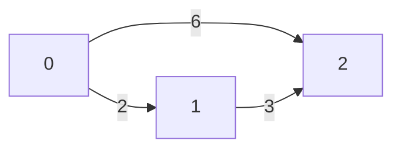
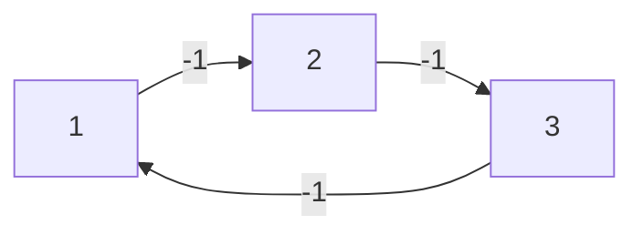
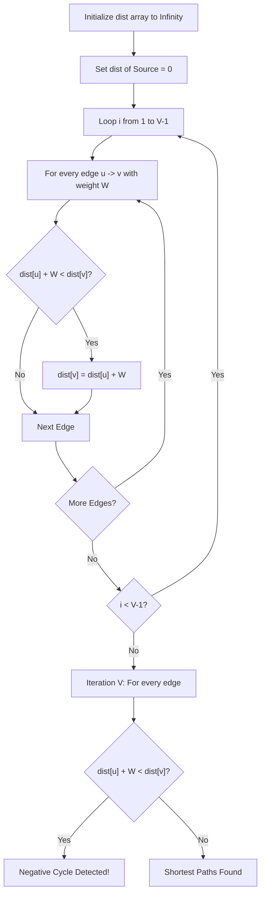
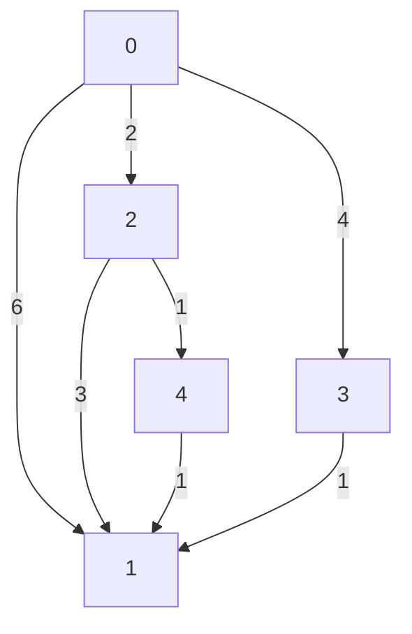

# Graph Algorithms Practice

This folder contains my solutions and notes for various Graph problems and algorithms. Below is a list of problems I solved and the key concepts learned from each.

## 📌 Problems & Learnings

1. **G-21. topoSort.cpp** - Learned how to perform Topological Sorting using DFS.
2. **G-22. Kahn's_algo.cpp** - Topological sorting using BFS (Kahn's Algorithm) with indegree array.
3. **G-23. Detect_a_Cycle_in_Directed_Graph.cpp** - Used Kahn's Algorithm / DFS to detect if a cycle exists in a directed graph.
4. **G-25. Find_Eventual_Safe_States_Kahn's.cpp** - Reversed the graph edges and used Kahn's algorithm to find safe nodes.
5. **G-26. Alien_Dictionary.cpp** - Modeled string ordering as a directed graph to find the alien alphabet order using Topological Sort.
6. **G-27. Shortest_Path_in_DAG.cpp** - Used Topological Sort to find the shortest path in a Directed Acyclic Graph efficiently `O(V+E)`.
7. **G-28. Shortest_Path_in_Undirected_Graph_with_Unit_Weights.cpp** - Used simple BFS queue to find the shortest distance since weights are uniform.
8. **G-29. Word_Ladder_I.cpp** - Solved using BFS to find the shortest transformation sequence from start word to end word.
9. **G-30. Word_Ladder_II.cpp** - Kept track of all shortest paths using BFS + backtracking (DFS).
10. **G-32. Dijkstra's_Algorithm_using_PQ.cpp** - Implemented Dijkstra using a Min-Heap (Priority Queue).
11. **G-33. Dijkstra's_Algorithm_using_set.cpp** - Implemented Dijkstra using `std::set` which helps in erasing existing larger distance nodes.
12. **G-35. Print_Shortest_Path_Dijkstra's_Algorithm.cpp** - Used a parent array to trace back the shortest path.
13. **G-36. Shortest_Distance_in_a_Binary_Maze.cpp** - Used BFS to find the shortest clear path in a 2D grid. (Dijkstra not needed as weight is uniform 1).
14. **G-37. Path_With_Minimum_Effort.cpp** - Used Dijkstra to minimize the maximum absolute difference in heights in a path.
15. **G-38. Cheapest_Flights_Within_K_Stops.cpp** - Used a Queue (BFS style) rather than PQ, because steps/stops constraint was more important than absolute distance.
16. **G-39. Minimum_Multiplications_to_Reach_End.cpp** - Dijkstra's concept applied on a modulo graph `(node * arr[i]) % 100000`.
17. **G-40. Number_of_Ways_to_Arrive_at_Destination.cpp** - Maintained an extra `ways[]` array in Dijkstra to count paths with the exact shortest distance.
18. **G-41. Bellman_Ford_Algorithm.cpp** - Learned how to compute shortest paths with negative weights and detect negative cycles.
19. **G-42. Floyd_Warshall_Algorithm.cpp** - Learned how to compute all-pairs shortest paths using the Dynamic Programming based Floyd-Warshall Algorithm.

---

## 🌎 Real-Life Applications of Core Graph Algorithms

### 1. Topological Sorting (DFS / Kahn's BFS)

**Real-Life Problem:** Course Prerequisites or Task Scheduling.
**Example:** You want to graduate, but you must take "Math 101" before "Physics 201", and "Physics 201" before "Quantum Mechanics".
**How it solves it:** Topological sort puts nodes (courses) in a straight line so that every prerequisite appears before its dependent course. If a cycle exists (e.g., A requires B, B requires A), topological sort will fail to process all nodes, which also helps detect impossible task loops!

### 2. Dijkstra's Algorithm

**Real-Life Problem:** Google Maps or GPS Navigation.
**Example:** You want the fastest route from your Home to the Airport. The roads are edges, and the travel time (or distance) is the weight.
**How it solves it:** Dijkstra's algorithm uses a priority queue to always explore the shortest known path first. It acts like water flowing through pipes; it reaches closest intersections first until it hits the destination. (Note: Dijkstra cannot handle negative weights, just like driving backward doesn't decrease the fuel you already used!)

### 3. Bellman-Ford Algorithm

**Real-Life Problem:** Financial Arbitrage or Network Routing Protocols.
**Example:** Suppose you convert USD $\to$ EUR $\to$ GBP $\to$ USD. Because of mismatched currency exchange rates, you might end up with MORE money than you started with. This is a "negative weight cycle" in graph terms!
**How it solves it:** By intentionally trying to update distances "One More Time" after $V-1$ iterations. If the cost (or currency exchange penalty) drops further, the algorithm flags a negative loop, instantly alerting traders to an arbitrage opportunity.

### 4. Floyd-Warshall Algorithm

**Real-Life Problem:** Telecommunication Networks or Multi-city Logistics.
**Example:** An internet service provider wants to know the fastest latency between _every_ possible pair of servers (routers) simultaneously to quickly reroute traffic if a connection drops. Or, an airline wants a lookup table of the absolute cheapest connecting flights between _all_ 100 cities they operate in.
**How it solves it:** Instead of calculating from one starting city, it tests every single city as a "layover" (the intermediate node _k_). It computes an "All-Pairs Shortest Path" matrix that can be referenced `O(1)` time later.

---

## ⚖️ Shortest Path Algorithms Comparison: When to use what?

| Algorithm | Graph Constraints | When to use? | Why? | Time Complexity |
| :--- | :--- | :--- | :--- | :--- |
| **Dijkstra** | Single-Source, Non-negative weights | When you need the shortest path from *one* source to all nodes, and the graph has **no negative edges**. | It uses a greedy approach (Priority Queue) making it practically the fastest for large graphs. Fails on negative weights. | $O(E \log V)$ |
| **Bellman-Ford** | Single-Source, Handles negative weights | When the graph has **negative weights** or you explicitly need to **detect negative weight cycles**. | Relaxes all edges $V-1$ times. Guaranteed to find shortest paths even with negative weights. Slower than Dijkstra. | $O(V \times E)$ |
| **Floyd-Warshall** | All-Pairs, Handles negative weights | When you need shortest paths between **every possible pair** of nodes, or graph is small ($V \le 400$). | Computes "all-pairs" simultaneously. Excellent for answering multiple $O(1)$ queries after preprocessing. | $O(V^3)$ |

---

## 🚀 Dijkstra's Algorithm

### How it works

Dijkstra's Algorithm finds the shortest path from a source node to all other nodes in a graph with non-negative edge weights.
It uses a **Min-Heap (Priority Queue)** to always process the node with the current shortest known distance.

**Edge Relaxation:**
If the distance to reach a node `u` plus the weight of the edge `u -> v` is less than the current known distance to `v`, we update the distance to `v`.

```cpp
if (dist[u] + weight < dist[v]) {
    dist[v] = dist[u] + weight;
    pq.push({dist[v], v});
}
```

### Step-by-Step Example

Assume Source Node is **0**.



1. Start at `0` (dist = 0).
2. Relax edges from `0`: `0->1` makes dist to `1` = 2. `0->2` makes dist to `2` = 6.
3. Pick smallest unused node: `1`.
4. Relax edges from `1`: `1->2` (weight 3). New dist to `2` is `dist[1] + 3 = 2 + 3 = 5`. Since 5 < 6, update `dist[2]=5`.
5. Shortest path to `2` is now 5.

---

## 🛠 Bellman-Ford Algorithm

### How it works

Unlike Dijkstra, Bellman-Ford can handle **negative edge weights**. It works by "relaxing" all edges exactly `V - 1` times (where V is the number of vertices). If we relax the edges one more time (the N-th iteration) and any distance still decreases, it means the graph has a **Negative Weight Cycle**.

### Where is Bellman-Ford needed?

- When the graph has **negative weights**. Dijkstra fails with negative weights because it assumes once a node is processed, its shortest distance is final.
- When we have to **detect negative cycles** (e.g., arbitrage opportunities in financial markets).

### Question 1: Why exactly N - 1 iterations are needed?

In the worst-case scenario, the shortest path between any two nodes can have at most `V - 1` edges.

Imagine a graph with edges processed in the reversed order of the path:


If our source is `0` and edges are given as: `3->4`, `2->3`, `1->2`, `0->1`

- **Iteration 1**: Only `0 -> 1` can be relaxed. `dist[1]` becomes 1. Other edges are skipped because source node distances are still infinity.
- **Iteration 2**: Now `dist[1]` is known, so `1 -> 2` can be relaxed. `dist[2]` becomes 2.
- **Iteration 3**: Now `dist[2]` is known, so `2 -> 3` can be relaxed. `dist[3]` becomes 3.
- **Iteration 4**: `3 -> 4` is relaxed. `dist[4]` becomes 4.

So for a graph of 5 nodes, it took exactly `V - 1 = 4` iterations for the distance to propagate from the source to the farthest node. This guarantees that `V - 1` iterations are sufficient for ANY graph!

### Question 2: How does it detect a negative cycle in the N-th iteration?

A negative cycle is a cycle where the total sum of edge weights is less than zero. Every time you go around the cycle, your distance decreases.

Let's look at this example negative cycle graph:



If there is a negative cycle, you can keep spinning in that cycle to get a path with `-∞` cost.
Since the maximum valid shortest path length is `V - 1`, if we relax all edges one more time (the V-th or N-th time) and the distance to ANY node drops again, it mathematically proves that an infinite negative loop (negative cycle) exists.

### Flowchart of Bellman-Ford



---

## 🌐 Floyd-Warshall Algorithm

### What is Multi-Source Shortest Path?

Instead of finding the shortest path from _one single starting node_ to all other nodes (like Dijkstra or Bellman-Ford), a **Multi-Source Shortest Path** algorithm finds the shortest path between **every possible pair** of nodes in the graph at once.

### Why is it needed?

- Sometimes we need to know the shortest distance from _Node A to B_, _Node C to D_, _Node E to B_, all at the same time.
- Running Dijkstra $V$ times (for each vertex as a source) takes $O(V \times E \log V)$. If the graph is dense (lots of edges) or has negative edges, it becomes very slow or incorrect.
- Floyd-Warshall solves this elegantly in $O(V^3)$ using Dynamic Programming and handles negative edge weights perfectly.

### Beginner Friendly Analogy: The "Shortcut" Approach

Imagine you are trying to travel from **City A** to **City B**. The direct flight costs ₹6000.
But what if you take a flight from **City A to City K (via)**, and then another flight from **City K to City B**?
If City A $\to$ City K costs ₹2000 and City K $\to$ City B costs ₹3000, then the total via City K is ₹5000.
Since ₹5000 < ₹6000, you have found a **shorter path**!

Floyd-Warshall does exactly this. It checks every single node as a possible "City K" (middleman) to see if routing the path through it makes the journey cheaper.

### How it works (The "Via Node" Concept)

The core idea is simple: **Can I find a shorter path from node $i$ to node $j$ by going through an intermediate node $k$?**

Let's assume our path goes from Node $i$ to Node $j$. We try to inject a middleman node $k$.
If we can reach $k$ from $i$ (meaning `dist[i][k]` is valid), and $j$ from $k$ (meaning `dist[k][j]` is valid), we check:
Is `Distance(i to j)` > `Distance(i to k) + Distance(k to j)`?
If yes, we update our distance to the newly found shorter path:

```cpp
// Check if paths via k exist
if (dist[i][k] != infinity && dist[k][j] != infinity) {
    // Take the minimum of direct path vs path going via node 'k'
    dist[i][j] = min(dist[i][j], dist[i][k] + dist[k][j]);
}
```

We do this checking by making every vertex (from $0$ to $N-1$) the intermediate node $k$ one by one, step-by-step.

> **💡 Important Detail for Beginners:**
> Why check `!= infinity`? Because if node `k` is unreachable from `i`, then `dist[i][k]` is infinity. Adding any number to infinity might cause an integer overflow in C++ (e.g., $10^8 + 1$). Also, logically, if you can't reach the middleman, you can't use him for a shortcut!

### Beginner Friendly Example

Consider the following graph:

- $0 \to 2$ (weight 2)
- $0 \to 1$ (weight 6)
- $0 \to 3$ (weight 4)
- $2 \to 4$ (weight 1)
- $2 \to 1$ (weight 3)
- $3 \to 1$ (weight 1)
- $4 \to 1$ (weight 1)

**Visual Representation of the Directed Graph:**



Let's analyze calculating the shortest path from **Node 0 to Node 1**.
Initially, using only direct edges, the distance is **6**. (So, `dist[0][1] = 6`)

Then we gradually introduce middleman nodes ($k$), keeping track of paths found so far:

- **Via Node 2 ($k=2$):** Path $0 \to 2 \to 1$. Distance = $dist[0][2] + dist[2][1] = 2 + 3 = 5$. Since 5 < 6, we update the matrix: `dist[0][1] = 5`. (We also discover path to $4$: $dist[0][4] = dist[0][2] + dist[2][4] = 2 + 1 = 3$).
- **Via Node 3 ($k=3$):** Path $0 \to 3 \to 1$. Distance = $dist[0][3] + dist[3][1] = 4 + 1 = 5$. It's not strictly smaller than our current 5, no change.
- **Via Node 4 ($k=4$):** Can we reach 4 from 0? Yes! Our previous steps stored `dist[0][4] = 3`. So, Path $0 \to \dots \to 4 \to 1$. Distance = $dist[0][4] + dist[4][1] = 3 + 1 = 4$. Since 4 < 5, update `dist[0][1] = 4`.

Ultimately, the shortest path from $0$ to $1$ becomes **4**!

### Matrix Calculation Step-by-Step

Let's see how the Adjacency Matrix updates at each iteration when we set $k = 0, 1, 2, 3, 4$.

**1. Initial Matrix ($\text{when } k = -1$, direct edges only):**
| From/To | 0 | 1 | 2 | 3 | 4 |
|---|---|---|---|---|---|
| **0** | 0 | 6 | 2 | 4 | $\infty$ |
| **1** | $\infty$ | 0 | $\infty$ | $\infty$ | $\infty$ |
| **2** | $\infty$ | 3 | 0 | $\infty$ | 1 |
| **3** | $\infty$ | 1 | $\infty$ | 0 | $\infty$ |
| **4** | $\infty$ | 1 | $\infty$ | $\infty$ | 0 |

**2. Matrix via $k = 0$ (Considering Node 0 as middleman):**

- Remains unchanged because nobody can reach node 0 anyway.

**3. Matrix via $k = 1$ (Considering Node 1 as middleman):**

- Remains unchanged because from node 1 we cannot go anywhere.

**4. Matrix via $k = 2$ (Considering Node 2 as middleman):**

- $0 \to 1$ via 2: $dist[0][2] + dist[2][1] = 2 + 3 = 5$. Update `dist[0][1] = 5`.
- $0 \to 4$ via 2: $dist[0][2] + dist[2][4] = 2 + 1 = 3$. Update `dist[0][4] = 3`.
  | From/To | 0 | 1 | 2 | 3 | 4 |
  |---|---|---|---|---|---|
  | **0** | 0 | **5** | 2 | 4 | **3** |
  _(Rest remains same)_

**5. Matrix via $k = 3$ (Considering Node 3 as middleman):**

- Matrix remains same. $0 \to 1$ via 3 gives $4 + 1 = 5$, but we already found a path of length 5 earlier. (Nothing strictly smaller).

**6. Matrix via $k = 4$ (Considering Node 4 as middleman):**

- $0 \to 1$ via 4: Uses `dist[0][4]` which was calculated in $k=2$ step as 3. So, $dist[0][4] + dist[4][1] = 3 + 1 = 4$. Update `dist[0][1] = 4`.
- $2 \to 1$ via 4: $dist[2][4] + dist[4][1] = 1 + 1 = 2$. Update `dist[2][1] = 2`.

**Final Output Matrix:**
| From/To | 0 | 1 | 2 | 3 | 4 |
|---|---|---|---|---|---|
| **0** | 0 | **4** | 2 | 4 | 3 |
| **1** | $\infty$ | 0 | $\infty$ | $\infty$ | $\infty$ |
| **2** | $\infty$ | **2** | 0 | $\infty$ | 1 |
| **3** | $\infty$ | 1 | $\infty$ | 0 | $\infty$ |
| **4** | $\infty$ | 1 | $\infty$ | $\infty$ | 0 |

By the end of iterating $k$ sequentially, we evaluated every possible nested combination of paths dynamically, confirming the core algorithm principle!
