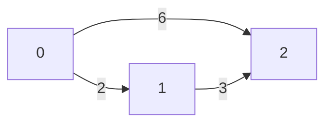
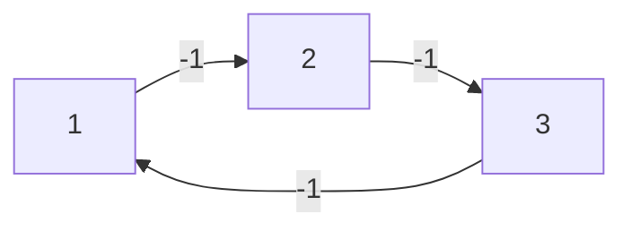

# Graph Algorithms Practice

This folder contains my solutions and notes for various Graph problems and algorithms. Below is a list of problems I solved and the key concepts learned from each.

## 📌 Problems & Learnings

- **G-21. topoSort.cpp** - Learned how to perform Topological Sorting using DFS.
- **G-22. Kahn's_algo.cpp** - Topological sorting using BFS (Kahn's Algorithm) with indegree array.
- **G-23. Detect_a_Cycle_in_Directed_Graph.cpp** - Used Kahn's Algorithm / DFS to detect if a cycle exists in a directed graph.
- **G-25. Find_Eventual_Safe_States_Kahn's.cpp** - Reversed the graph edges and used Kahn's algorithm to find safe nodes.
- **G-26. Alien_Dictionary.cpp** - Modeled string ordering as a directed graph to find the alien alphabet order using Topological Sort.
- **G-27. Shortest_Path_in_DAG.cpp** - Used Topological Sort to find the shortest path in a Directed Acyclic Graph efficiently `O(V+E)`.
- **G-28. Shortest_Path_in_Undirected_Graph_with_Unit_Weights.cpp** - Used simple BFS queue to find the shortest distance since weights are uniform.
- **G-29. Word_Ladder_I.cpp** - Solved using BFS to find the shortest transformation sequence from start word to end word.
- **G-30. Word_Ladder_II.cpp** - Kept track of all shortest paths using BFS + backtracking (DFS).
- **G-32. Dijkstra's_Algorithm_using_PQ.cpp** - Implemented Dijkstra using a Min-Heap (Priority Queue).
- **G-33. Dijkstra's_Algorithm_using_set.cpp** - Implemented Dijkstra using `std::set` which helps in erasing existing larger distance nodes.
- **G-35. Print_Shortest_Path_Dijkstra's_Algorithm.cpp** - Used a parent array to trace back the shortest path.
- **G-36. Shortest_Distance_in_a_Binary_Maze.cpp** - Used BFS to find the shortest clear path in a 2D grid. (Dijkstra not needed as weight is uniform 1).
- **G-37. Path_With_Minimum_Effort.cpp** - Used Dijkstra to minimize the maximum absolute difference in heights in a path.
- **G-38. Cheapest_Flights_Within_K_Stops.cpp** - Used a Queue (BFS style) rather than PQ, because steps/stops constraint was more important than absolute distance.
- **G-39. Minimum_Multiplications_to_Reach_End.cpp** - Dijkstra's concept applied on a modulo graph `(node * arr[i]) % 100000`.
- **G-40. Number_of_Ways_to_Arrive_at_Destination.cpp** - Maintained an extra `ways[]` array in Dijkstra to count paths with the exact shortest distance.
- **G-41. Bellman_Ford_Algorithm.cpp** - Learned how to compute shortest paths with negative weights and detect negative cycles.

---

## 🚀 Dijkstra's Algorithm

### How it works
Dijkstra's Algorithm finds the shortest path from a source node to all other nodes in a graph with non-negative edge weights.
It uses a **Min-Heap (Priority Queue)** to always process the node with the current shortest known distance. 

**Edge Relaxation:**
If the distance to reach a node `u` plus the weight of the edge `u -> v` is less than the current known distance to `v`, we update the distance to `v`.
```cpp
if (dist[u] + weight < dist[v]) {
    dist[v] = dist[u] + weight;
    pq.push({dist[v], v});
}
```


### Step-by-Step Example
Assume Source Node is **0**.

1. Start at `0` (dist = 0).
2. Relax edges from `0`: `0->1` makes dist to `1` = 2. `0->2` makes dist to `2` = 6.
3. Pick smallest unused node: `1`.
4. Relax edges from `1`: `1->2` (weight 3). New dist to `2` is `dist[1] + 3 = 2 + 3 = 5`. Since 5 < 6, update `dist[2]=5`.
5. Shortest path to `2` is now 5.

---

## 🛠 Bellman-Ford Algorithm

### How it works
Unlike Dijkstra, Bellman-Ford can handle **negative edge weights**. It works by "relaxing" all edges exactly `V - 1` times (where V is the number of vertices). If we relax the edges one more time (the N-th iteration) and any distance still decreases, it means the graph has a **Negative Weight Cycle**.

### Where is Bellman-Ford needed?
- When the graph has **negative weights**. Dijkstra fails with negative weights because it assumes once a node is processed, its shortest distance is final.
- When we have to **detect negative cycles** (e.g., arbitrage opportunities in financial markets).

### Question 1: Why exactly N - 1 iterations are needed?
In the worst-case scenario, the shortest path between any two nodes can have at most `V - 1` edges. 

Imagine a graph with edges processed in the reversed order of the path:

If our source is `0` and edges are given as: `3->4`, `2->3`, `1->2`, `0->1`
- **Iteration 1**: Only `0 -> 1` can be relaxed. `dist[1]` becomes 1. Other edges are skipped because source node distances are still infinity.
- **Iteration 2**: Now `dist[1]` is known, so `1 -> 2` can be relaxed. `dist[2]` becomes 2.
- **Iteration 3**: Now `dist[2]` is known, so `2 -> 3` can be relaxed. `dist[3]` becomes 3.
- **Iteration 4**: `3 -> 4` is relaxed. `dist[4]` becomes 4.

So for a graph of 5 nodes, it took exactly `V - 1 = 4` iterations for the distance to propagate from the source to the farthest node. This guarantees that `V - 1` iterations are sufficient for ANY graph!

### Question 2: How does it detect a negative cycle in the N-th iteration?
A negative cycle is a cycle where the total sum of edge weights is less than zero. Every time you go around the cycle, your distance decreases.

Let's look at this example negative cycle graph:

If there is a negative cycle, you can keep spinning in that cycle to get a path with `-∞` cost. 
Since the maximum valid shortest path length is `V - 1`, if we relax all edges one more time (the V-th or N-th time) and the distance to ANY node drops again, it mathematically proves that an infinite negative loop (negative cycle) exists.


### Flowchart of Bellman-Ford
```mermaid
graph TD
    A[Initialize dist array to Infinity] --> B[Set dist of Source = 0]
    B --> C[Loop i from 1 to V-1]
    C --> D[For every edge u -> v with weight W]
    D --> E{dist[u] + W < dist[v]?}
    E -- Yes --> F[dist[v] = dist[u] + W]
    E -- No --> G[Next Edge]
    F --> G
    G --> H{More Edges?}
    H -- Yes --> D
    H -- No --> I{i < V-1?}
    I -- Yes --> C
    I -- No --> J[Iteration V: For every edge]
    J --> K{dist[u] + W < dist[v]?}
    K -- Yes --> L[Negative Cycle Detected!]
    K -- No --> M[Shortest Paths Found]
```
